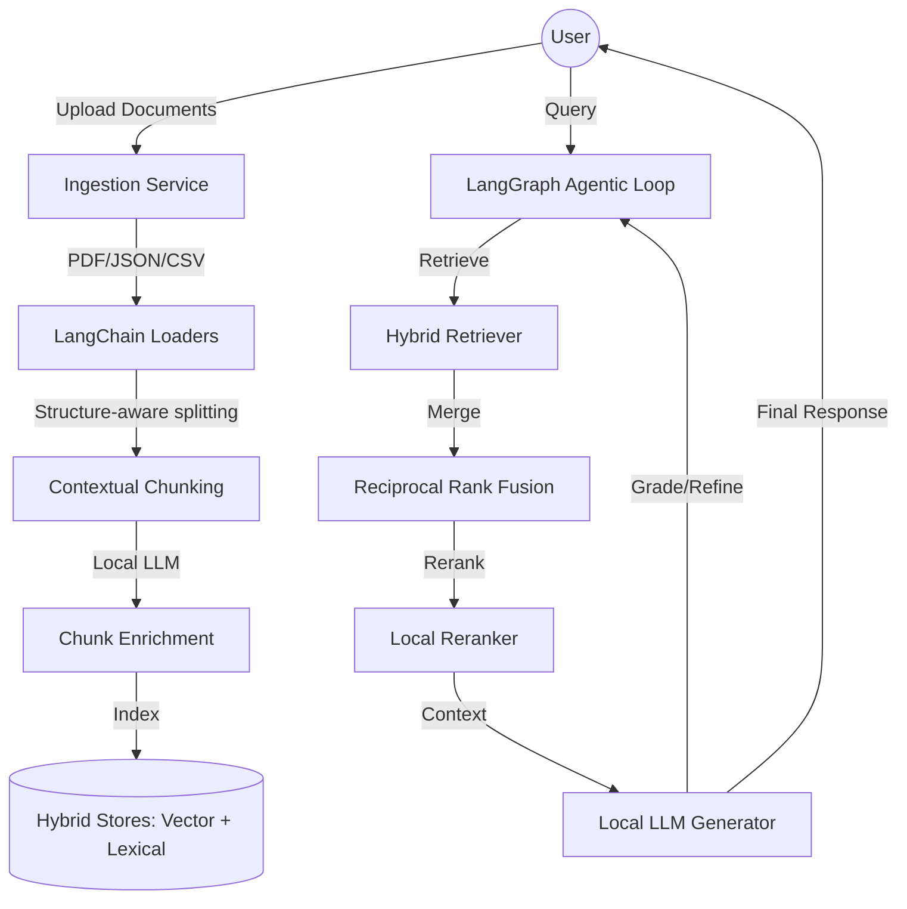

# 🚀 HybridRAG: Agentic Local-First Intelligence


HybridRAG is a state-of-the-art, **local-first** Retrieval-Augmented Generation system designed for privacy, speed, and agentic reasoning. By combining **LangChain**, **LangGraph**, and local LLMs (via Ollama/LM Studio), HybridRAG provides a professional-grade intelligence layer that runs entirely on your hardware.

---

## ✨ Key Features

- **🧠 Agentic Reasoning**: Powered by LangGraph, the system doesn't just retrieve; it reasons. It grades retrieved context, refines queries, and loops until the answer is optimal.
- **🔍 Hybrid Retrieval**: Seamlessly merges Vector Search (Semantic) with Lexical Search (BM25) using **Reciprocal Rank Fusion (RRF)** for maximum accuracy.
- **📄 Contextual Chunking**: Automatically enriches document chunks with high-level summaries before indexing, preventing lost context in large documents.
- **⚡ Zero-Cost Stack**: Built for the local ecosystem. No OpenAI keys, no subscription fees—just pure local performance.
- **🛡️ Privacy First**: Your data never leaves your machine. Perfect for sensitive documents and enterprise-grade privacy requirements.
- **💎 Premium Dashboard**: A glassmorphism-inspired React UI with smooth animations, real-time streaming, and interactive source citations.

---

## 🏗️ Architecture



---

## 🛠️ Tech Stack

| Layer             | Technology                                                                                       |
| :---------------- | :----------------------------------------------------------------------------------------------- |
| **Orchestration** | [LangGraph](https://github.com/langchain-ai/langgraphjs), [LangChain](https://js.langchain.com/) |
| **Backend**       | Node.js, Express                                                                                 |
| **Frontend**      | React, CSS (Glassmorphism), Lucide Icons                                                         |
| **Local LLM**     | Ollama / LM Studio (Llama 3, Mistral, Gemma)                                                     |
| **Embeddings**    | Nomic-Embed-Text (Local) / Hugging Face adapter (Cloud)                                          |
| **Storage**       | ChromaDB (Vector), BM25 (Lexical)                                                                |

---

## 🚀 Quick Start

### 1. Prerequisites

- **Node.js**: v18+
- **Ollama**: [Download here](https://ollama.com/)
- **Models**:
  ```bash
  ollama pull llama3
  ollama pull nomic-embed-text
  ```

### 2. Installation

```bash
# Clone the repository
git clone https://github.com/your-username/HybridRAG.git
cd HybridRAG

# Install root dependencies
npm install

# Install workspace dependencies
npm install -w client
npm install -w server
```

### 3. Environment Setup

Copy `.env.example` to `.env` in the root and configure your paths:

```env
# Backend
APP_PORT=3001
OLLAMA_BASE_URL=http://localhost:11434
OLLAMA_EMBEDDING_MODEL=nomic-embed-text:latest
EMBEDDING_PROVIDER=local

# Cloud embeddings
# EMBEDDING_PROVIDER=cloud
# HUGGINGFACE_API_TOKEN=your_token
# HUGGINGFACE_EMBEDDING_MODEL=sentence-transformers/all-MiniLM-L6-v2

# Storage
DATA_DIR=./server/data
```

### 4. Run the Application

```bash
# Start both client and server in development mode
npm run dev:server
npm run dev:client
```

### 5. Ingestion Dashboard

To launch the Streamlit uploader UI for the ingestion pipeline:

```powershell
cd apps/dashboard
streamlit run streamlit_app.py
```

By default the dashboard posts files to `http://127.0.0.1:8000/api/ingest/`. You can change the API base URL in the sidebar.

---

## 📂 Project Structure

```text
├── client/              # React frontend (Vite)
├── server/              # Node.js backend
│   ├── src/
│   │   ├── ingest/      # Document processing & Enrichment
│   │   ├── retrieval/   # Hybrid search logic
│   │   ├── orchestration/# LangGraph agent definitions
│   │   └── runtime/     # Local LLM connectors
├── data/                # Local document storage
└── scripts/             # Utility & Evaluation scripts
```

---

## 🗺️ Roadmap

- [ ] **V1.1**: Streaming support for real-time answer generation.
- [ ] **V1.2**: Advanced Query Rewriting agent node.
- [ ] **V2.0**: Support for DOCX, XLSX, and Markdown with specialized loaders.
- [ ] **V2.1**: Interactive graph visualization of retrieved chunks.

---

## 📄 License

This project is licensed under the MIT License - see the [LICENSE](LICENSE) file for details.

---

<p align="center">Built with ❤️ for the Local AI Community</p>
